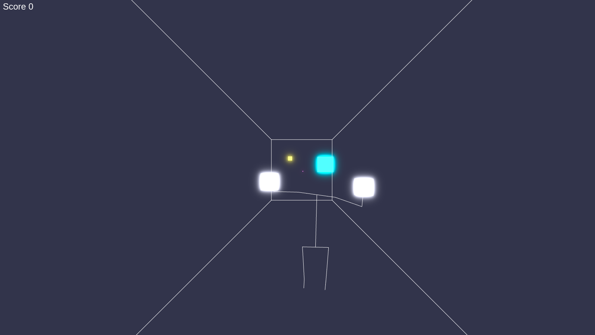

# BabySaber

A prototype game to have something like BeatSaber in the browser based
on your body via webcam recorded.
The "sabers" are you wrists and you need to hit blocks, which are in
the 3D space.

Uses the webcam with googles posenet to identify your skeleton
in front of you camera

## DEMO

[Github Pages hosted DEMO](https://derandreas-dt.github.io/babylonjs-posenet-babysaber/)

This little demo is hosted on GitHub Pages and served from the dist folder.
So should be latest build with the newest bugs :)

## Images and HowTo

## NOTES

  * first game with BabylonJS and "3D Space"
  * it has no sound, no beat detection, blocks are randomly flying towards you
  * this is not a real game (it has a score counter! *yeah*)
  * toggle skeleton view bei pressing "s"
  * toggle axis viewer by pressing "a"
  * toggle fullscreen with "f"

## Mentions

  * utilize the [BabylonJS Engine](https://www.babylonjs.com/)
  * based on the BabylonJS TS template by Oktinaut [Github Link](https://github.com/oktinaut/babylonjs-typescript-starter)
  * uses tensorflow posenet [GitHub Link](https://github.com/tensorflow/tfjs-models/tree/master/posenet)
  * the BabylonJS Community and their BabylonJS playgroud for examples

## License

MIT License
